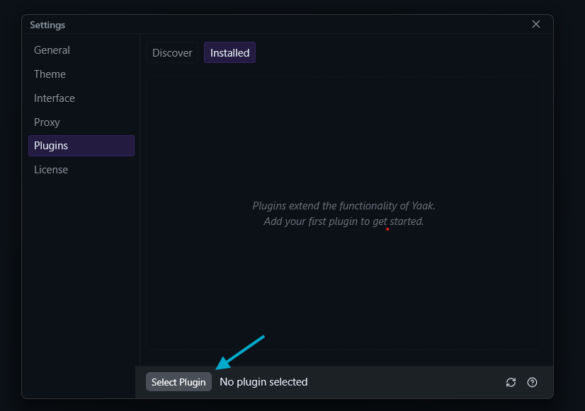
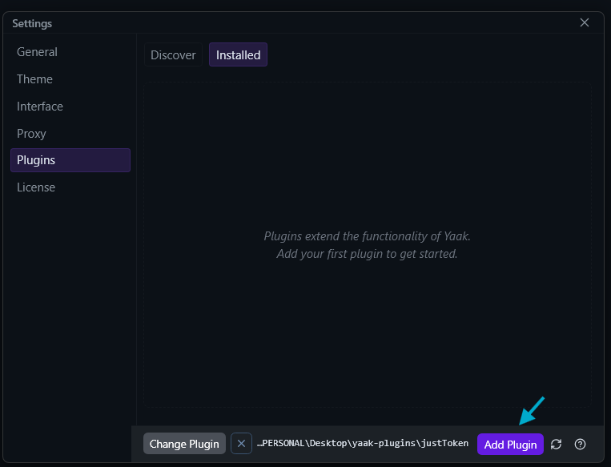

# JustToken :page_facing_up:

El fin de este plugin es agilizar el proceso de copiar el token de una respuesta en [Yaak.app](https://yaak.app/)

## Instalación

1. Clonar el repositorio

```bash
git clone https://github.com/gabz-23/justToken-yaak-plugin.git
```

2. Instalar los node_modules

```bash
npm install
```

3. Exportar el plugin en Yaak  

### :white_check_mark: Con estos pasos puedes disfrutar de jusToken

Si te ha gustado, dejamelo saber apoyando el repositorio con una estrella :star:
